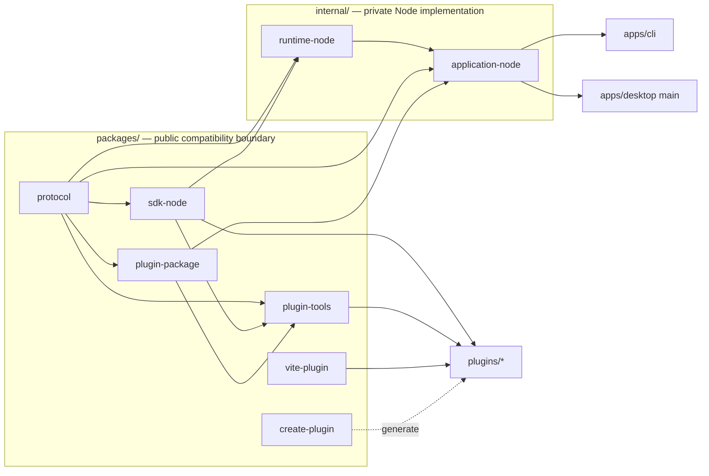
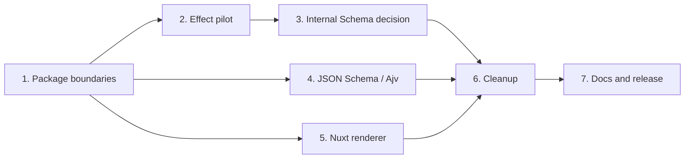

# Tooldeck 1.4 Planning

本文是 Tooldeck 1.4 的规划入口。1.4 不增加新的 TPP contribution 或产品能力，而是在
Tooldeck 1.3 已完成的可信本地插件闭环上，收敛 package、Node application/runtime、校验、
错误边界和 Desktop renderer 工程结构。

规划来源是 [GitHub Issue #28](https://github.com/origin-coding/tooldeck/issues/28) 的正文、
七项规划评论和后续补充决议。Issue 中已经被后续评论修正的早期表述不作为本文依据。

## Status

```text
Planning accepted; implementation issues created; planning PR pending.
```

Tooldeck 1.4 的目标版本为 `1.4.0`。本版本不建立 alpha、beta 或 rc 发布流程；开发期间通过
源码、CI 和构建产物验证，完成 release gate 后直接发布 `1.4.0`。

## Version Theme

```text
Clarify public and private boundaries, then converge the implementation.
```

## 1.3 Compatibility Baseline

Tooldeck 1.4 必须保持以下既有闭环：

```text
external plugin authoring
  -> build
  -> .tdplugin package
  -> CLI / Desktop install
  -> manifest scan
  -> lazy activation
  -> command execution
  -> ContentBlock output
  -> SQLite history
  -> enable / disable
  -> uninstall
  -> retained-data purge
```

“兼容 TPP v1”在 1.4 中具有明确边界：

- 能通过 Tooldeck 1.3 官方 `plugin-tools` 检查。
- 位于当时协议文档和作者工具公开声明的支持范围内。
- 不依赖 runtime 偶然透传的完整 Ajv 能力。

Runtime 曾经接受但未被公开支持的 `oneOf`、`anyOf`、`$ref`、`$id` 等 command input
能力不构成 1.4 兼容性承诺。1.4 不新增 manifest `schemaVersion`，而是将公开工具与 runtime
收敛到同一个 TPP v1 command input profile。

## Goals

- 将公开 package 与私有 Node 实现通过 `packages/` 和 `internal/` 明确分开。
- 将私有实现收敛为 `@tooldeck/runtime-node` 和 `@tooldeck/application-node`。
- 让 CLI 和 Desktop main 只通过 application use-case facade 使用产品能力。
- 建立按 `manifest.runtime.kind` 选择 host 的 runtime registry，同时只实现 Node host。
- 在 internal package 中有限试点 Effect，并根据证据决定保留、缩小或退出。
- 在 Effect 试点后，从 Zod 与 Effect Schema 中选择一种内部 Schema 方案。
- 继续使用 Ajv 处理 TPP 与外部 JSON Schema，并集中编译、缓存和错误转换。
- 将 Desktop renderer 等价迁移到 Nuxt CSR，并保持单一、按领域拆分的
  `window.tooldeck` bridge。
- 在主要迁移后集中删除重复实现、无效依赖和临时兼容代码。
- 更新长期文档，建立统一 release gate，完成 `1.4.0` 发布和发布后验证。

## Target Workspace

```text
apps/
  cli/
  desktop/

packages/
  protocol/
  sdk-node/
  plugin-package/
  plugin-tools/
  vite-plugin/
  create-plugin/

internal/
  runtime-node/
  application-node/

plugins/
  hello-world/
  json-tools/
  regex-tools/
```

目录含义：

```text
packages/  = 对外发布并承担兼容性责任
internal/  = Tooldeck 私有实现，不提供外部兼容承诺
apps/      = 可执行产品入口和平台适配
plugins/   = Tooldeck 插件项目
```

## Dependency Direction

箭头表示“被依赖方 → 消费方”。



核心约束：

- `packages/*` 不得依赖 `internal/*`、`apps/*` 或 `plugins/*`。
- `runtime-node` 不得依赖 `application-node`、SQLite、Electron 或 UI。
- `application-node` 可以依赖 runtime 和公开 package，但不得依赖 Electron、CLI formatter
  或 renderer framework。
- CLI 和 Desktop main 通过 `application-node` 使用产品能力。
- Desktop preload 和 renderer 不得导入 `internal/*`。
- 插件项目只能依赖公开作者 package。
- Workspace package graph 不得存在环。

## Planning Tracks

详细规划位于 `docs/planning/1.4/`：

1. [Package Boundaries](./1.4/01-package-boundaries.md)
2. [Effect Pilot](./1.4/02-effect-pilot.md)
3. [Internal Schema Decision](./1.4/03-internal-schema-decision.md)
4. [JSON Schema and Ajv](./1.4/04-json-schema-ajv.md)
5. [Desktop Nuxt Migration](./1.4/05-desktop-nuxt-migration.md)
6. [Migration Cleanup](./1.4/06-migration-cleanup.md)
7. [Documentation and Release](./1.4/07-documentation-release.md)

建议实施顺序：



规划 5 的低风险 pnpm Catalog 与开发脚本准备可以提前独立落地，但 React 到 Nuxt 的迁移应在
主要功能和 Desktop contract 稳定后进行。

## Decision Status

| 决定                                | 状态     | 记录                                                                                      |
| ----------------------------------- | -------- | ----------------------------------------------------------------------------------------- |
| 公开 package 与 `internal/` 边界    | Accepted | [ADR 0005](../architecture/decisions/0005-public-packages-and-internal-implementation.md) |
| Runtime-kind host registry          | Accepted | [ADR 0006](../architecture/decisions/0006-runtime-kind-host-registry.md)                  |
| Apps 只接收 `ApplicationError`      | Accepted | [ADR 0007](../architecture/decisions/0007-application-error-only-facade.md)               |
| TPP v1 command input Schema profile | Accepted | [ADR 0008](../architecture/decisions/0008-tpp-v1-command-input-schema-profile.md)         |
| Nuxt CSR renderer 与 preload bridge | Accepted | [ADR 0009](../architecture/decisions/0009-nuxt-csr-renderer-and-preload-bridge.md)        |
| Effect 最终采用范围                 | 待试点   | 由规划 2 的 application pilot Issue 决定并在需要时新增 ADR                                |
| Zod / Effect Schema 最终选择        | 待决策   | 由规划 3 的独立选型 Issue 决定并在需要时新增 ADR                                          |

待试点结论不得在实现前写成 Accepted ADR，也不得通过长期保留两套实现规避选择。

## Implementation Issue Map

所有实施 Issue 均已加入 `1.4.0` Milestone，并作为
[Issue #28](https://github.com/origin-coding/tooldeck/issues/28) 的 GitHub sub-issues。跨任务顺序
使用 GitHub `blocked by` 关系维护。

| 规划 | 实施 Issue                                                                                                                |
| ---- | ------------------------------------------------------------------------------------------------------------------------- |
| 1    | [#29 Consolidate the Node runtime and add runtime-kind host routing](https://github.com/origin-coding/tooldeck/issues/29) |
| 1    | [#30 Consolidate Node application services](https://github.com/origin-coding/tooldeck/issues/30)                          |
| 1    | [#31 Migrate CLI and Desktop to the Node application service](https://github.com/origin-coding/tooldeck/issues/31)        |
| 2    | [#32 Pilot Effect for plugin runtime lifecycle](https://github.com/origin-coding/tooldeck/issues/32)                      |
| 2    | [#33 Pilot Effect for application lifecycle and error boundaries](https://github.com/origin-coding/tooldeck/issues/33)    |
| 3    | [#34 Evaluate and select the internal Schema solution](https://github.com/origin-coding/tooldeck/issues/34)               |
| 4    | [#35 Define the supported command input Schema profile](https://github.com/origin-coding/tooldeck/issues/35)              |
| 4    | [#36 Centralize Ajv compilation and validator caching](https://github.com/origin-coding/tooldeck/issues/36)               |
| 4    | [#37 Align Schema diagnostics and deduplicate Ajv](https://github.com/origin-coding/tooldeck/issues/37)                   |
| 5    | [#38 Adopt pnpm Catalog and simplify development orchestration](https://github.com/origin-coding/tooldeck/issues/38)      |
| 5    | [#39 Split the preload bridge by domain](https://github.com/origin-coding/tooldeck/issues/39)                             |
| 5    | [#40 Migrate the renderer to Nuxt CSR](https://github.com/origin-coding/tooldeck/issues/40)                               |
| 6    | [#41 Converge Tooldeck 1.4 migration leftovers](https://github.com/origin-coding/tooldeck/issues/41)                      |
| 7    | [#42 Finalize Tooldeck 1.4 documentation and release verification](https://github.com/origin-coding/tooldeck/issues/42)   |

单个实施 Issue 应有明确的主要所属规划；跨规划依赖通过链接和 blocked-by 表达。一个规划拆成
多个 Issue 时，全部必需 Issue 完成后该规划才算完成。

## Non-goals

- 插件市场、远程安装、签名或依赖解析。
- 不可信插件 sandbox。
- WASM runtime 或新的 manifest runtime kind。
- MCP、OpenAPI adapter。
- 插件热更新。
- 新的 TPP contribution type。
- 复杂权限流程。
- Effect 全仓库迁移或公开插件 SDK Effect 化。
- 用内部 Schema library 替换 TPP JSON Schema。
- 与架构收敛无关的产品功能。

## Release Success Criteria

- 目标 workspace map、依赖方向和 import boundary checks 成立。
- 六个公开 package 的 exports、tarball 和 `.d.ts` 不泄漏 internal、Effect 或内部 Schema 类型。
- CLI/Desktop 只识别 `ApplicationError`；runtime 来源保留 `source: "runtime"`。
- Manifest scan 与 install 不激活插件；command 继续 lazy activation。
- Tooldeck 1.3 官方支持范围内的 TPP v1 manifest 和真实 `.tdplugin` fixture 继续可用。
- 外部插件完成 build → pack → install → run。
- CLI 与 Desktop 完成 list、run、history、disable、enable、uninstall 和 purge。
- Nuxt renderer 可在开发和 packaged Electron 环境运行，renderer 不接触 raw IPC、SQLite 或
  plugin runtime。
- 完整 repository verification 通过：

```text
pnpm format:check
pnpm lint
pnpm typecheck
pnpm test:run
pnpm build
pnpm check:desktop-boundaries
pnpm smoke:cli
```

- 公共 npm package、Git tag、Desktop 三平台产物和 GitHub Release 来自同一个不可变
  release commit。
- `v1.4.0` 发布后完成 CLI、插件作者流程和 Desktop smoke verification。
